**РОССИЙСКИЙ УНИВЕРСИТЕТ ДРУЖБЫ НАРОДОВ** 

**Факультет физико-математических и естественных наук Кафедра прикладной информатики и теории вероятностей** 

**ОТЧЕТ**  

**ПО ЛАБОРАТОРНОЙ РАБОТЕ № 2** 

*дисциплина:  Архитектура компьютера *

Студент: Нестерова Дарья Антоновна         Группа: НКАбд-04-25         

**МОСКВА** 2025 г. 

**Содержание** 

1. Цель работы……………………………………………………………………4  
1. Выполнение лабораторной работы………………………………………..5-15  
- 2.1 Настройка github…………………………………….……………………….…5 
- 2.2 Базовая настройка git ………………………………….……………………….6 
- 2.3 Создание SSH-ключа …………………………………………………………..7 
- 2.4 Создание рабочего пространства и репозитория курса на основе шаблона ………………………………………………………………………………………..9  
- 2.5 Создание репозитория курса на основе шаблона…………………………......9  
- 2.6 Настройка каталога курса……………………………………………………..10 
- 2.7 Задание для самостоятельной работы……………………...………………...13 
3. Вывод…………………………………………………………………………..16  Список литературы………………………………………………………………17 

   **Список иллюстраций** 

   1\_1 Регистрация на GitHub …………………………………………………...................6  2\_1 Установка git ………………………………………………………………………....6  2\_2 Имя и почта……………………………………………………………………...........6 2\_3 Настройка utf-8 и имя начальной ветки ………………………………....................7  2\_4 Настройка параметров...……………………………………………………………..7  3\_1 Создание ключей…………………………………………………………………......7  3\_2 Копирование ключа…………………………………………………………………..8  3\_3 ssh-ключ на GitHub……………………………………………………………..…….8  4\_1 Создание каталогов для предмета «Архитектура компьютера»…………………..9  5\_1 Создание репозитория на основе шаблона.………………………………………...9  5\_2 Клонирование репозитория…...……………………………………………………..9  6\_1 Подготовка файлов…………………………………………………………………..10 6\_2 Команды add и commit …………………………………….…………….……….....10  6\_3 Команда push…………………………………………………………....………..…..11  6\_4 Иерархия в локальном репозитории…...…………………………………………...11 6\_5 Иерархия на странице github………………..………………………………………11  7\_1\_1 Создание файла…………………………...……………………………………….12  7\_1\_2 Проверка наличия файла ……………...……………………………………...….12  7\_2\_1 Копирование отчета за предыдущую работу…….……………………..……….13 7\_2\_2 Проверка корректности копирования…………………...………………….……13  7\_3\_1 Отправка изменений на удаленный репозиторий….……………………..……..13 7\_3\_2 Проверка корректности выполненных команд...……………………………..…14  

1. **Цель работы** 

Целью  работы  является  изучение  идеологии  и применения  средств контроля версий,  приобретение  практических  навыков  по  работе  с  системой  контроля версий git.

2. **Выполнение лабораторной работы**
1. *Настройка github* 

\1) Создайте учётную запись на сайте https://github\.com/ и заполните основные данные\. Я успешно зарегистрировалась на GitHub и заполнила основные данные\. 

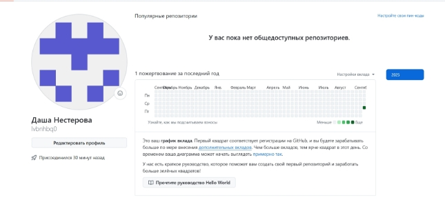

1\_1 Регистрация на GitHub  

2. *Базовая настройка git*

Откройте терминал и введите следующие (написаны в файле) команды. 

Для  работы  с  системой  контроля  версий  Git  необходимо  было  установить пакеты, отвечающие за корректную работу системы. Установила: 

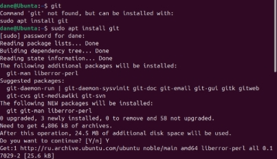

2\_1 Установка git 

Открыла терминал и ввела необходимые команды. Указала имя и e-mail владельца репозитория: 

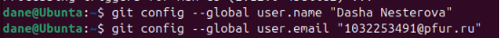

2\_2 Имя и почта 

Настроила utf-8 в выводе сообщений git и задала имя начальной ветки (master) : 

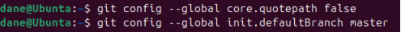

2\_3 Настройка utf-8 и имя начальной ветки  

Также настроила другие параметры для корректной работы: 

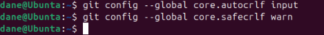

2\_4 Настройка параметров 

3. *Создание SSH-ключа*

\1)  Для  последующей  идентификации  пользователя  на  сервере  репозиториев необходимо сгенерировать пару ключей (приватный и открытый)\. 

Я сгенерировала и скопировала ключ: 

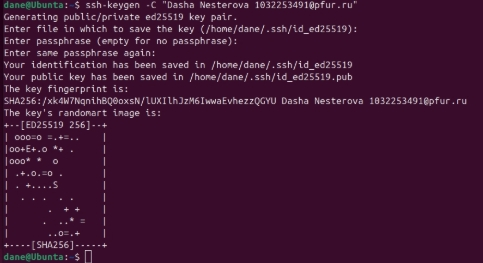

3\_1 Создание ключей 

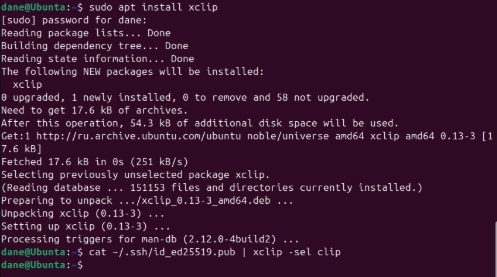

3\_2 Копирование ключа 

Добавила ключ на GitHub, следуя инструкции: 

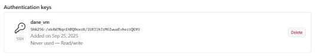

3\_3 ssh-ключ на GitHub 

Я сгенерировала ssh-ключ. Это позволяет мне безопасно подключаться к моему репозиторию на GitHub. Публичный ключ добавлен в настройки аккаунта на GitHub,  а  приватный  остался  на  моем  компьютере,  что  обеспечивает безопасность соединения. 

4. *Создание рабочего пространства и репозитория курса на основе шаблона* 

   Откройте  терминал  и  создайте  каталог  для  предмета  «Архитектура компьютера», по правилам структуры рабочего пространства, описанным выше. 

   Создала последовательность каталогов: 

4\_1 Создание каталогов для предмета «Архитектура компьютера» 

5. *Создание репозитория курса на основе шаблона* 

Репозиторий  на  основе  шаблона  можно  создать  через  web-интерфейс  github. Перейдите  на  станицу  репозитория  с  шаблоном  курса https://github.com/yamadharma/cour se-directory-student-template. Далее выберите Use  this  template.  В  открывшемся  окне  задайте  имя  репозитория  (Repository name) study\_2025–2026\_arh-pc и создайте репозиторий (кнопка Create repository from template). 

Создала  репозиторий  на  основе  шаблона,  следуя  инструкциям,  указанным  в задании: 

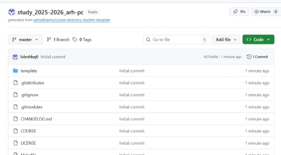

5\_1 Создание репозитория на основе шаблона 

Откройте  терминал  и  перейдите  в  каталог  курса,  клонируйте  созданный репозиторий. 

Я скопировала ссылку на созданный репозиторий на GitHub, открыла терминал, перешла в каталог курса и клонировала созданный репозиторий: 

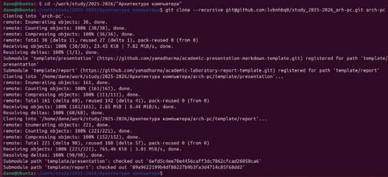

5\_2 Клонирование репозитория 

6. *Настройка каталога курса* 

Перейдите в каталог курса и создайте необходимые каталоги. Я перешла в каталог курса и выполнила подготовку структур: 

6\_1 Подготовка файлов 

Отправьте  файлы  на  сервер  и  проверьте  правильность  создания  иерархии рабочего пространства в локальном репозитории и на странице github. 

Я добавила изменения в индекс (git add), зафиксировала их с комментарием (git commit)  и  отправила  файлы  на  удаленный  сервер  (git  push). Теперь  все  мои локальные изменения синхронизированы с GitHub: 

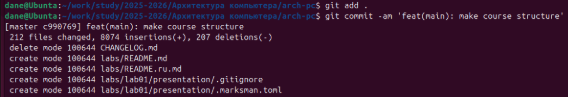

6\_2 Команды add и commit  

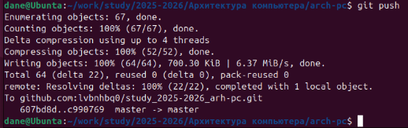

6\_3 Команда push 

Проверила  правильность  создания  иерархии  рабочего  пространства  в локальном репозитории и на странице github (итог: всё верно): 

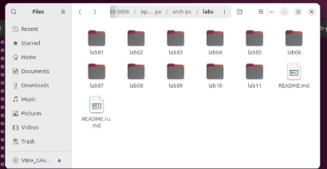

6\_4 Иерархия в локальном репозитории 

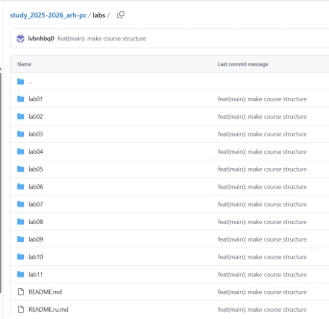

6\_5 Иерархия на странице github 

7. *Задание для самостоятельной работы* 
1. Создайте  отчет  по  выполнению  лабораторной  работы  в  соответствующем каталоге рабочего пространства (labs/lab02/report). 

   Создала в данном каталоге файл формата pdf для будущего отчета, проверила его наличие в папке: 

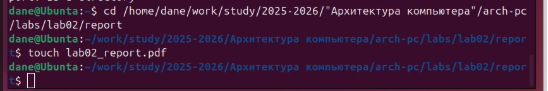

7\_1\_1 Создание файла 

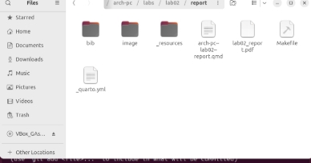

7\_1\_2 Проверка наличия файла 

2. Скопируйте  отчеты  по  выполнению  предыдущих  лабораторных  работ  в соответствующие каталоги созданного рабочего пространства. 

   Я скачала свой отчет по выполнению предыдущей домашней работы, немного переименовала  и  скопировала  его  в  соответствующий  каталог  созданного рабочего пространства: 

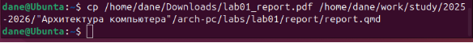

7\_2\_1 Копирование отчета за предыдущую работу 

Проверила корректность копирования (итог: всё верно): 

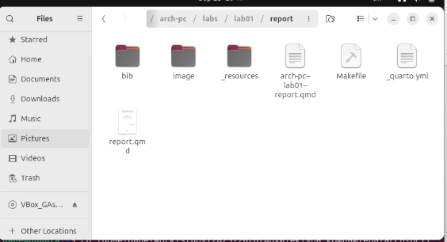

7\_2\_2 Проверка корректности копирования 

3. Загрузите файлы на github. 

Все новые файлы я добавила, закоммитила и отправила на GitHub: 

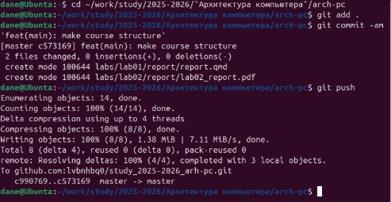

7\_3\_1 Отправка изменений на удаленный репозиторий 

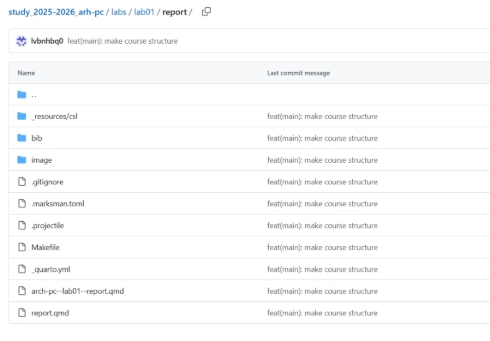

7\_3\_2 Проверка корректности выполненных команд 

**Примечание:** после окончания написания мной данного отчета, итоговый файл будет  загружен  в  соответствующую  папку  в  локальный  репозиторий  (и автоматически появится на странице GitHub) 

**3. Вывод** 

В ходе выполнения лабораторной работы я освоила основы работы с системой контроля  версий  Git  и  платформой  GitHub.  Были  получены  практические навыки  по  настройке  локального  репозитория,  генерации  SSH-ключей  для безопасного подключения, созданию и клонированию репозитория на основе шаблона, а также организации структуры рабочего пространства в соответствии с требованиями. Кроме того, я научилась выполнять основные команды Git для добавления,  фиксации  и  отправки  изменений  на  удаленный  репозиторий. Работа позволила закрепить понимание важности контроля версий в процессе разработки и совместной работы над проектами. 

**Список литературы**

1. Введение - О системе контроля версий:[ https://git-scm.com/book/ru/v2/Введение- О-системе-контроля-версий ](https://git-scm.com/book/ru/v2/Введение-О-системе-контроÐ)
1. What  is  Git  version  control? [ https://about.gitlab.com/topics/version-control/what- isgit-version-control/ ](https://about.gitlab.com/topics/version-control/what-isgit-version-control/)
1. Основные команды GIT[ / https://habr.com/ru/articles/918386/ ](https://habr.com/ru/articles/918386/)
1. Курс на туис: [https://esystem.rudn.ru/enrol/index.php?id=112 ](https://esystem.rudn.ru/enrol/index.php?id=112)
1. Методические  указания  : [https://esystem.rudn.ru/mod/resource/view.php?id=1030495 ](https://esystem.rudn.ru/mod/resource/view.php?id=1030495)
1. Шаблон  выполнения  лабораторной  работы: [https://github.com/evdvorkina/study_2022-2023_arh-pc/tree/master ](https://github.com/evdvorkina/study_2022-2023_arh-pc/tree/master)
17 
