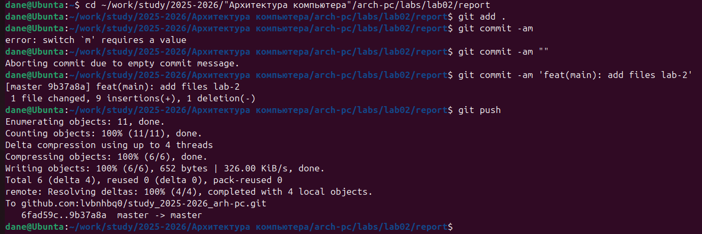

**РОССИЙСКИЙ УНИВЕРСИТЕТ ДРУЖБЫ НАРОДОВ** 

**Факультет физико-математических и естественных наук Кафедра прикладной информатики и теории вероятностей** 

**ОТЧЕТ**  

**ПО ЛАБОРАТОРНОЙ РАБОТЕ № 3** 

*дисциплина:  Архитектура компьютера *

Студент: Нестерова Дарья Антоновна         Группа: НКАбд-04-25         

**МОСКВА** 2025 г. 

**Содержание** 

1. Цель работы……………………………………………………………………4  
1. Выполнение лабораторной работы………………………………………..5-9  
   1. 2.1 Основные задания………………….……………….……………………….…5 
   1. 2.2 Задание для самостоятельной работы……………………...………………...9 
1. Вывод…………………………………………………………………………..10  Список литературы………………………………………………………………11 

**Список иллюстраций** 

Рис. 1 Обновление изменений в директории курса..………………………...................5  Рис. 2 Компиляция шаблона..…………………………………………………………....5  Рис. 3 Проверка компиляции..……………………………………………………...........6 Рис. 4 Удаление сгенерированных шаблонов..……………………………....................6  Рис. 5 Проверка удаления...…………………….………………………………………..6  Рис. 6 Файл………....…………………………………………………………………......7  Рис.7 Подготовка отчета…..……………………………………………………………..7  Рис. 8 Установка tinytex..…………………………………………………………..…….8  Рис. 9 Загрузка файлов…………………………………………………………………..8  Рис. 10 Подготовка отчета по лабораторной №2……………………………………....9 Рис. 11 Загрузка файлов 2.……………………....……………………………………....9  

1. **Цель работы** 

Целью данной лабораторной работы является освоение процедуры оформления отчетов с помощью легковесного языка разметки Markdown.

2. **Выполнение лабораторной работы** 
2. *1 Основные задания*** 

В  терминале  перехожу  в  директорию  курса,  обновляю  репозиторий  с удаленного на GitHub: 

Рис. 1 Обновление изменений в директории курса 

Провожу  компиляцию  шаблона  с  помощью  команды  make,  проверяю корректность исполнения команды:  

Рис. 2 Компиляция шаблона 

Рис. 3 Проверка компиляции 

После  проверки  работоспособности  компилятора  шаблонов,  я  удаляю сгенерированные  файлы  с  помощью  команды  make  clean,  проверяю корректность исполенения команды: 

Рис. 4 Удаление сгенерированных шаблонов  

Рис. 5 Проверка удаления 

Открываю  файл  report.md  c  помощью  любого  текстового  редактора  (geditС, предварительно  установив  его,  с  помощью  редактора  выполняю  отчет  по выполненной лабораторной работе :

Рис. 6 Файл 

Рис. 7 Подготовка отчета 

**Дополнительно:** в ходе работы мне было необходимо установить tinytex, что я и делаю: 

Рис. 8 Установка tinytex 

Загружаю файлы на Github : 

Рис. 9 Загрузка файлов

*2.2  Задание для самостоятельной работы* 

Аналогично выполнению отчета по текущей лабораторной работе, я выполняю отчет  в  markdown  и  по  второй  лабораторной  работе,  для  этого  перехожу  в директорию  2  лабораторной  работы  и  готовлю  отчет  с  помощью  текстового редактора tinytex: 

)

Рис. 10 Подготовка отчета по лабораторной работе 2 

Загружаю файлы на Github: 

Рис. 11 Загрузка файлов 2

3. **Вывод** 

Выполнение  данной  лабораторной  работы  позволило  мне  освоить  методику оформления отчетов с применением языка разметки Markdown. 

**Список литературы**

1. [Курс на ТУИС ](https://esystem.rudn.ru/course/view.php?id=112)
2. [Лабораторная работа №3 ](https://esystem.rudn.ru/pluginfile.php/2945867/mod_resource/content/0/lab3.pdf)
3. [Пример выполнения лабораторной работы ](https://esystem.rudn.ru/pluginfile.php/2088992/mod_resource/content/0/%D0%9F%D1%80%D0%B8%D0%BC%D0%B5%D1%80%20%D0%BE%D1%84%D0%BE%D1%80%D0%BC%D0%BB%D0%B5%D0%BD%D0%B8%D1%8F%20%D0%BE%D1%82%D1%87%D0%B5%D1%82%D0%B0%20%D0%BF%D0%BE%20%D0%BB%D0%B0%D0%B1%D0%BE%D1%80%D0%B0%D1%82%D0%BE%D1%80%D0%BD%D0%BE%D0%B9%20%D1%80%D0%B0%D0%B1%D0%BE%D1%82%D0%B5.pdf)

